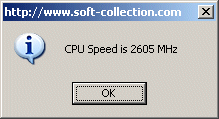



## \[ Get CPU Speed in MHz \]

### Description

How to get the CPU Speed in MHz
 
### More Info
 

             |
---                |---
**Submitted On**   |2004-12-10 12:49:32
**By**             |[Michael Margold](https://github.com/Planet-Source-Code/PSCIndex/blob/master/ByAuthor/michael-margold.md)
**Level**          |Advanced
**User Rating**    |4.3 (30 globes from 7 users)
**Compatibility**  |VB 5\.0, VB 6\.0
**Category**       |[Windows API Call/ Explanation](https://github.com/Planet-Source-Code/PSCIndex/blob/master/ByCategory/windows-api-call-explanation__1-39.md)
**World**          |[Visual Basic](https://github.com/Planet-Source-Code/PSCIndex/blob/master/ByWorld/visual-basic.md)
**Archive File**   |[\[\_Get\_CPU\_18285112122004\.zip](https://github.com/Planet-Source-Code/michael-margold-get-cpu-speed-in-mhz__1-57646/archive/master.zip)

